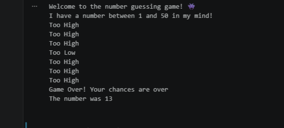

# Python_Number_Guessing_Game_W3D3

# 🎮 Python Number Guessing Game

## 📌 About the Project

This is a simple Number Guessing Game built in Python as part of the **Code to AI — Python & Data Science (Week 3)** assignment.

The computer randomly selects a number, and the player has to guess it. The game provides hints after each guess and includes extra features like **difficulty levels** and **limited guesses**.

---

## ✨ Features

* 🎲 Random number generation using Python's `random` module
* 🎯 Two difficulty levels:

  * **Easy (1–50)**
  * **Hard (1–100)**
* 🔢 Limited to **7 guesses**
* 📈 Counts the number of guesses used
* 💡 Gives hints:

  * Too High
  * Too Low
* 🎉 Congratulates the player when they guess correctly
* ❌ Reveals the correct number if all chances are used

---

## 🛠️ Concepts Used

* Functions
* Loops (`while`)
* Conditional Statements (`if`, `elif`, `else`)
* `random` Module
* User Input (`input()`)
* Variables

---

## ▶️ How to Run

1. Make sure Python 3 is installed.
2. Clone this repository or download the project files.

> git clone [github.com/FatimaZN/Python_Number_Guessing_Game_W3D3.git](https://github.com/FatimaZN/Python_Number_Guessing_Game_W3D3.git)

1. Open the project folder in your terminal.
2. Run the Python file:

```bash
Python_Number_Guessing_Game_W3D3.py
```

5. Choose a difficulty level:

   * **A** for Easy (1–50)
   * **B** for Hard (1–100)
6. Try to guess the number within **7 attempts**.

---

## 📸 Screenshot

A preview of the game



---

## 👨‍💻 Author

Fatima Zahra Narejo 

Created as part of the **Code to AI — Python & Data Science** Week 3 assignment.
